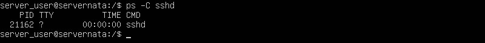
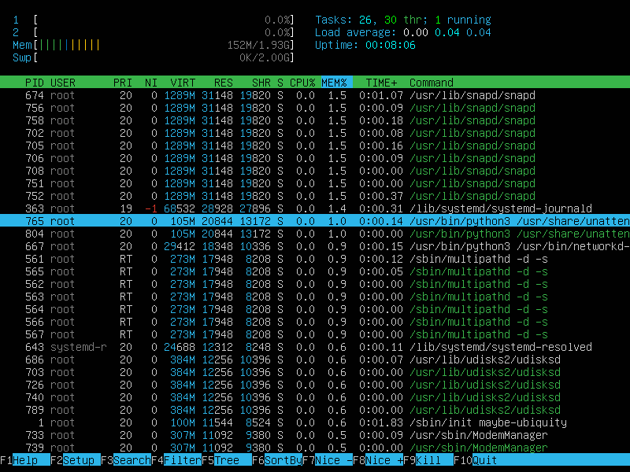
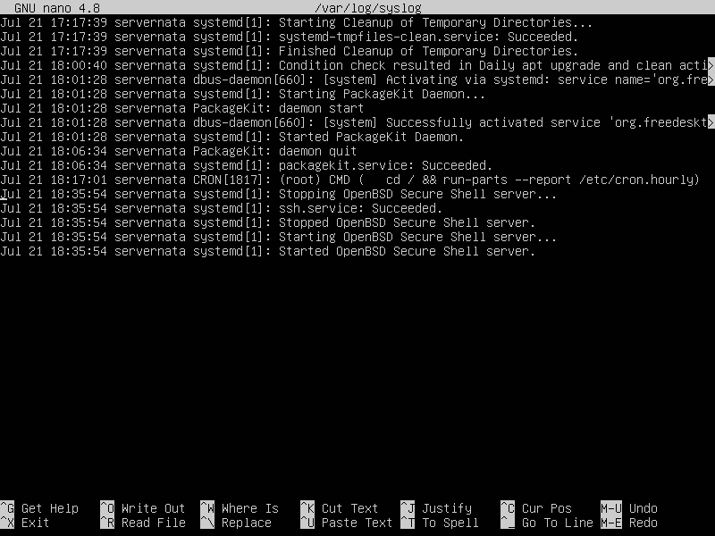
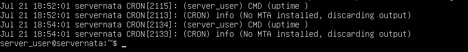

# DO-1

## Part 1. Установка ОС 

## Part 2. Создание пользователя

## Part 3. Настройка сети ОС 

Задай название машины вида user-1

1. sudo vim /etc/hostname
2. "server_nata" -> "user-1"
3. save hostname
4. sudo reboot

Установи временную зону

1. sudo timedatectl set-timezone Europe/Moscow
2. timedatectl (для проверки)

Выведи названия сетевых интерфейсов

Интерфейс lo (от "loopback") - это специальный сетевой интерфейс, который представляет собой петлю в операционной системе. Он используется для связи внутри одного компьютера, не выходя за пределы сетевой карты.

Используя консольную команду, получи ip адрес устройства от DHCP сервера

DHCP (Dynamic Host Configuration Protocol - Протокол динамической конфигурации узла) - это протокол, который позволяет компьютерам автоматически получать настройки сети, такие как IP-адрес, маска подсети, адрес шлюза и DNS-серверы.

Определи и выведи на экран внешний 

ip-адрес шлюза (ip) и внутренний IP-адрес шлюза

Задай статичные настройки ip, gw, dns

## Part 4. Обновление ОС

## Part 5. Использование команды sudo

Команда `sudo` — это мощный инструмент, который позволяет обычному пользователю временно получить права администратора (root) для выполнения команд, требующих повышенных привилегий.

## Part 6. Установка и настройка службы времени

## Part 7. Установка и использование текстовых редакторов

Esc :wq

Ctrl+X yes

Ctrl+K -X

Esc :q!

Ctrl+X no

Ctrl+C

Esc :/<>

Ctrl+W

Ctrl+K -F

Esc :.s/<>/<>

Ctrl+\ yes

Ctrl+k -F R Y

## Part 8. Установка и базовая настройка сервиса SSHD

Установи службу SSHd

sudo apt install ssh

Добавь автостарт службы при загрузке системы

sudo systemctl enable ssh.service

Перенастрой службу SSHd на порт 2022

Используя команду ps, покажи наличие процесса sshd. Для этого к команде нужно подобрать ключи

PS отвечает за отображение процессов -C выводит идентификаторы процессов по имени процесса

t - По протоколу TCP
a - Отображение всех подключений и ожидающих портов.
n - Отображение адресов и номеров портов в числовом формате. 
Cтолбцы: 
Recv-Q -количество запросов в очередях на приём на данном узле/компьютере
Send-Q -количество запросов в очередях на отправку на данном узле/компьютере
Local Address - адрес и номер локального конца сокета
Foreign Address - адрес и номер порта удаленного порта сокета
State - состояние сокета
0.0.0.0 в качестве адреса означает - любой адрес

## Part 9. Установка и использование утилит top, htop

Top:

uptime-18:19:00;
количество авторизованных пользователей-1;
средняя нагрузка на сервер-0.00,0.00,0.00(за 1,5 и 15 минут назад);
общее количество процессов-103;
загрузка cpu-(id-100%);
загрузка памяти-1971.4(all),1580.7(free),148.9(used);
pid процесса занимающего больше всего памяти-1;
pid процесса, занимающего больше всего процессорного времени-1;

Htop:

отсортированному по PID, PERCENT_CPU, PERCENT_MEM, TIME

отфильтрованному для процесса sshd

с процессом syslog, найденным, используя поиск

с добавленным выводом hostname, clock и uptime

## Part 10. Использование утилиты fdisk 

sudo fdisk -l

Disk model: VBOX HARDDISK;
Disk /dev/sda: 30.1 GiB;
4165005728 sectors.

Swap: 2.0 GiB

## Part 11. Использование утилиты df 

GB

ext4 Lunix

## Part 12. Использование утилиты du

## Part 13. Установка и использование утилиты ncdu

## Part 14. Работа с системными журналами 

time: jul 21 17:03:31;
user: server_user;
type: sudo.

SSHD:

## Part 15. Использование планировщика заданий CRON 

crontab -e

crontab -l

sudo grep CRON /var/log/syslog

