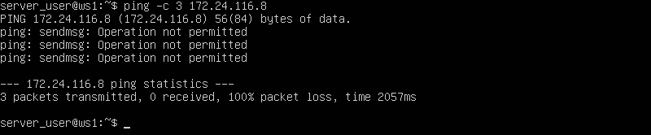
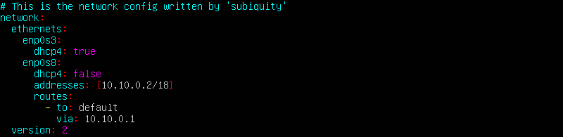
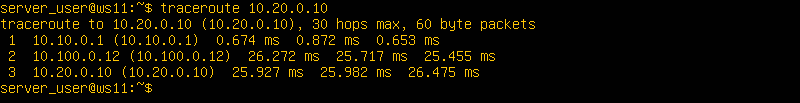
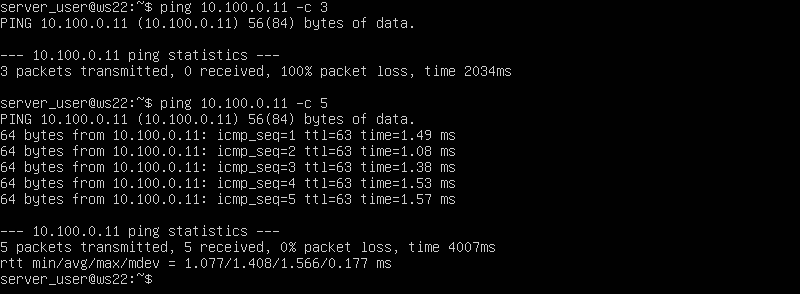

## Part 1. Инструмент ipcalc

**ipcalc** — это утилита, которая может выполнять простые манипуляции с адресами IPv4.
Инструмент ` ipcalc ` можно применять для следующих задач:
- проверить IP-адрес;
- показать рассчитанный широковещательный адрес;
- отображение имени хоста, определенного через DNS;
- отображение сетевого адреса или префикса.

### 1.1. Сети и маски

#### 1.1.1 Определяем адрес сети *192.167.38.54/13* с помощью команды

> ` ipcalc 192.167.38.54/13 `

Адрес сети: 192.160.0.0/13

#### 1.1.2 Перевод маски: 

> ` ipcalc 192.167.38.54/255.255.255.0 `

* префиксная форма записи */24* 
* двоичная форма записи *11111111.11111111.11111111.00000000*
  * 

> ` ipcalc 192.167.38.54/15 `
* обычная форма записи *255.254.0.0*
* двоичная *11111111.11111110.00000000.00000000*

> ` 11111111.11111111.11111111.11110000 `
* обычная форма записи *255.255.255.240*
* префиксная */28*

#### 1.1.3 Минимальный и максимальный хост в сети 12.167.38.4 при масках:

> ` ipcalc 12.167.38.4/8 `
* минимальный хост *12.0.0.1*
* максимальный хост *12.255.255.254* 

> ` ipcalc 12.167.38.4/11111111.11111111.00000000.00000000 `
эквивалентно
> ` ipcalc 12.167.38.4/16 `
* минимальный хост *12.167.0.1*
* максимальный хост *12.167.255.254*

> ` ipcalc 12.167.38.4/255.255.254.0 `

* минимальный хост *12.167.38.1*
* максимальный хост *12.167.39.254*

> ` ipcalc 12.167.38.4/4 `

* минимальный хост *0.0.0.1*
* максимальный хост *15.255.255.254*

### 1.2. localhost

Определить и записать в отчёт, можно ли обратиться к приложению, работающему на localhost, со следующими IP: 194.34.23.100, 127.0.0.2, 127.1.0.1, 128.0.0.1 .

* приложения к которым можно обратиться через localhost: *127.0.0.2, 127.1.0.1*

* приложения к которым нельзя обратиться через localhost: *194.34.23.100, 128.0.0.1*
> ` ipcalc 127.0.0.2 `

> ` ipcalc 127.1.0.2 `

> ` ipcalc 194.34.23.100 `

> ` ipcalc 128.0.0.1 `

### 1.3. Диапазоны и сегменты сетей

#### 1.3.0 Подсети (Subnets)

#### 1.3.1 Определить и записать в отчёт какие из перечисленных IP можно использовать в качестве публичного, а какие только в качестве частных: 10.0.0.45, 134.43.0.2, 192.168.4.2, 172.20.250.4, 172.0.2.1, 192.172.0.1, 172.68.0.2, 172.16.255.255, 10.10.10.10, 192.169.168.1. 

*Публичный IP адрес* - называется IP адрес, который используется для выхода в Интернет. 
*Частный IP адрес* - адреса, используемые в локальных сетях (не может быть напрямую подключен к Интернету).

* к публичным относятся следующие IP адреса: *134.43.0.2, 172.0.2.1, 192.172.0.1, 172.68.0.2, 192.169.168.1*

* к частным относятся следующие IP адреса: *10.0.0.45, 192.168.4.2, 172.20.250.4, 172.16.255.255, 10.10.10.10*

#### 1.3.2 Определить и записать в отчёт какие из перечисленных IP адресов шлюза возможны у сети 10.10.0.0/18: 10.0.0.1, 10.10.0.2, 10.10.10.10, 10.10.100.1, 10.10.1.25

* из перечисленных IP адресов шлюзов у сети 10.10.0.0/18 возможны следующие: 10.10.0.2, 10.10.10.10, 10.10.1.255 .

## Part 2. Статическая маршрутизация между двумя машинами

#### 2.0.1 Поднимаем две виртуальные машины  ws1 и ws2.

В настройках каждой машины во вкладке Сеть задаем Тип подключения: Внутренняя сеть.

#### 2.0.2 С помощью команды *ip a* смотрим существующие сетевые интерфейсы

#### 2.0.3 Описать сетевой интерфейс, соответствующий внутренней сети, на обеих машинах и задать следующие адреса и маски: ws1 - 192.168.100.10, маска /16, ws2 - 172.24.116.8, маска /12

Используем следующую команду для открытия файла и установки в нём статического адреса.

> ` sudo vim /etc/netplan/00-installer-config.yaml `

- ` etc/netplan/00-installer-config.yaml ` - файл который нужно отредактировать на каждой машине. Этот файл отвечает за настройку интерфейсов сети.

Дописываем в файлы соответствующие строки.

#### 2.0.4 Выполним команду *netplan apply* для перезапуска сервиса сети

> ` sudo netplan apply `

С помощью следующей команды перепроверяем настройки

> ` ip a `

### 2.1. Добавление статического маршрута вручную

#### 2.1.1 Добавим статический маршрут от одной машины до другой и обратно

> ` sudo ip route add 172.24.116.8 dev enp0s8 `

> ` sudo ip route add 192.168.100.0 dev enp0s8 `

#### 2.1.2 Пропингуем соединение между машинами с помощью следующей команды

> ` ping -c 5 <IP-address> `

- ` -c ` - указывает количество пакетов.

> ` ping -c 5 172.24.116.8 `

> ` ping -c 5 192.168.100.10 `

 и вот что получим (сверху видно что было до добавления маршрутов для каждой машины, внизу - после):

### 2.2. Добавление статического маршрута с сохранением

При перезапуске машин, видим, что измененные в предыдущем пункте данные не сохранились.

Добавляем статический маршрут от одной машины до другой, редактируя файл ` etc/netplan/00-installer-config.yaml `.

> ` sudo vim etc/netplan/00-installer-config.yaml `

Применяем новые настройки с помощью команды 

> ` sudo netplan apply `

Пропингуем соединение между машинами:

## Part 3. Утилита iperf3

### 3.1. Скорость соединения

Базовой единицей скорости передачи информации является бит в секунду (бит/с).
Разница между байтами в секунду (Б/с) и битами в секунду (бит/c) такая же, как разница между байтами (Б) и битами (бит): 1 Б/с = 8 бит/с.
Точно так же разница между килобайтами в секунду (КБ/с) и Б/с такая же, как разница между килобайтами и байтами: 1 КБ/с = 1024 Б/с. И так далее. 

Перевести и записать в отчёт:

* 8 Mbps (мегабит в секуду) = 1 MB/s (мегабайт в секунду)

* 100 MB/s (мегабайт в секунду) = 800 000 Kbps (килобит в секунду)

* 1 Gbps (гигабит в секунду) = 1 000 Mbps (мегабит в секунду)

### 3.2. Утилита iperf3

**iperf3** — кроссплатформенная консольная клиент-серверная программа — генератор TCP и UDP трафика для тестирования пропускной способности в IP-сетях (поддерживает IPv4 и IPv6). С ее помощью довольно просто измерить максимальную пропускную способность сети между сервером и клиентом и провести нагрузочное тестирование канала связи.
Поскольку утилита имеет как серверную часть так и клиентскую, надо рассматривать обе отдельно. 
Чтобы протестировать пропускную способность сети, вам нужно сначала подключиться к удаленной машине, которую вы будете использовать в качестве сервера. Для запуска сервера (по умолчанию он будет прослушивать порт 5201) используется синтаксис:

> ` iperf3 -s [опции] `

> ` iperf3 -s -f K
- ` -f ` - формат в котором выводить информацию (k - кбит, m - мегабит, g - гигабит или K - килобайт, M - мегабайт, G - гигабайт);

Затем на локальном компьютере, который рассматривается как клиент, нужно запустить **iperf3** в клиентском режиме, используя флаг *-c*, и указать хост, на котором работает сервер (используя либо его IP-адрес, либо домен, либо имя хоста).

> ` iperf3 -c [адрес_сервера] [опции] `

> ` iperf3 -c 192.168.10.1 -f K `

#### Измерим скорость соединения между ws1 и ws2 с помощью утилиты iperf3

Запускаем утилиту на ` ws1 ` в режиме сервер с флагом ` -s `. Она будет ожидать пока не запустится эт аже утилита на ` ws2 ` в режиме клиента.

> ` iperf3 -s ` 

Следом запускаем на ` ws2 ` утилиту в режиме клиент с флагом ` -c ` и указываем IP-адрес ` ws1 `.

> ` iperf3 -c 192.168.100.10 ` 

## Part 4. Сетевой экран

Сетевой или межсетевой экран – это комплекс программных или аппаратных средств, которые позволяют осуществлять фильтрацию и контроль проходящих через него пакетов в соответствии с заданными заранее параметрами.
Основная задача межсетевого экрана – это защита компьютерных сетей или конкретных узлов от доступа злоумышленников. Межсетевые экраны часто называют фильтрами, что связанно с их основной задачей – фильтровать пакеты, которые не подходят под критерии, определенные в конфигурации.

### 4.1. Утилита iptables

**iptables** — это утилита брандмауэра командной строки, которая использует цепочки политик для разрешения или блокировки трафика. Когда соединение пытается установиться в системе, ` iptables ` ищет правило в своем списке, чтобы сопоставить его. Если утилита не находит нужного правила, она прибегает к действию по умолчанию.

Переходим в кореневой каталог

> ` cd `

Создаем файл ` /etc/firewall.sh `, имитирующий фаерволл, на ` ws1 ` и ` ws2 `  и добавляем в файл следующие правила согласно задания:

> ` sudo vim /etc/firewall.sh `

1) на ` ws1 ` применить стратегию когда в начале пишется запрещающее правило, а в конце пишется разрешающее правило (это касается пунктов 4 и 5).

2) на ` ws2 ` применить стратегию когда в начале пишется разрешающее правило, а в конце пишется запрещающее правило (это касается пунктов 4 и 5).

3) открыть на машинах доступ для порта 22 (ssh) и порта 80 (http).

4) запретить *echo reply* (машина не должна "пинговаться”, т.е. должна быть блокировка на OUTPUT).

5) разрешить *echo reply* (машина должна "пинговаться").

Запустим файлы на обеих машинах командами

> ` sudo chmod +x /etc/firewall.sh `

> ` sudo bash /etc/firewall.sh `

Разница между стратегиями, применёнными в первом и втором файлах, заключается в следующем: в утилите ` iptables ` правила выполняются сверху вниз.
На первой машине первым указано запрещающее правило на выход, поэтому она не сможет пропинговать другую машину. У второй машины, наоброт - первым указано разрешающее правило, значит она сможет пропинговать другую машину.

### 4.2. Утилита nmap

**nmap** - это очень популярный сканер сети, для исследования сети и аудита безопасности.

Эта программа помогает системным администраторам очень быстро понять какие компьютеры подключены к сети, узнать их имена, а также посмотреть какое программное обеспечение на них установлено, какая операционная система и какие типы фильтров применяются. 

Одной из особенностей ` nmap ` является то, что эта утилита может определить, включен ли хост, даже если его нельзя пропинговать.

#### 4.2.1 Поиск машины, которая не "пингуется"

> ` ping IP-address `

В файле ` firewall.sh ` для первой машины первым было указано запрещающее правило, поэтому она не пингуется. Для проверки того чтобы показать, что хост машины запущен воспользуемся утилитой ` nmap `. 

Запускаем утилиту ` nmap ` командой (для проверки ищем в выводе ` nmap ` наличие строки ***Host is up***)

> ` sudo nmap IP-address `

#### 4.2.2 Сохраняем дампы образов виртуальных машин.

Для [сохранения образов машины] в настройках машины выбираем *Снимки - Сделать*.

Вид после создания снимков

В папке, где сохранен образ виртуальной машины, появится новая папка *Snapshots*.

## Part 5. Статическая маршрутизация сети

Создадим сеть, по следующей схеме

#### 5.0.1 Поднимаем пять виртуальных машин (3 рабочие станции (ws11, ws21, ws22) и 2 роутера (r1, r2)).

Сначала создаём одну виртуальную машину. Потом нажимаем правую клавишу мыши на вновь созданной машине, вибираем *Клонировать...* и клонируем ещё 4 машины с соответствующими заданию именами (` ws11 `, ` ws21 `, ` ws22 ` и ` r1 `, ` r2 `).

Задаём следующие настройки виртуальным машинам:

**1)** Для машины ` Router r1 ` в *Настроить - Сеть* выставляем:
- *Адаптер_1* оставляем как есть (*Тип подключения: NAT*);
- включаем *Адаптер_2*, выставляем *Тип подключения: Внутренняя сеть* и устанавливаем имя ` intnet1`;
- включаем *Адаптер_3*, выставляем *Тип подключения: Внутренняя сеть* и устанавливаем имя ` intnet2`.

Запускаем ` r1 ` и меняем имя хоста на соответствующее.
Перезагружаем машину ` r1 `.

**2)** Для машины ` Router r2 `:
- *Адаптер_1* оставляем как есть (*Тип подключения: NAT*);
- Включаем *Адаптер_2*, выставляем *Тип подключения: Внутренняя сеть* и устанавливаем имя ` intnet2`;
- Включаем *Адаптер_3*, выставляем *Тип подключения: Внутренняя сеть* и устанавливаем имя ` intnet3`.

Запускаем ` r2 ` и меняем имя хоста на соответствующее:
Перезагружаем машину ` r2 `.

**3)** Для машины ` PC-ws11 ` в *Настроить - Сеть*:
- *Адаптер_1* оставляем как есть (*Тип подключения: NAT*);
- включаем *Адаптер_2*, выставляем *Тип подключения: Внутренняя сеть* и устанавливаем имя ` intnet1`.

**4)** Для машин ` PC-ws21 ` и ` PC-ws22 `:
- *Адаптер_1* оставляем как есть (*Тип подключения: NAT*);
- включаем *Адаптер_2*, выставляем *Тип подключения: Внутренняя сеть* и устанавливаем имя ` intnet3`.

Запускаем все ` ws ` и меняем на них имя хоста на соответствующее:

Перезагружаем машины ` ws11 `, ` ws21 ` и ` ws22 `.

### 5.1. Настройка адресов машин

#### 5.1.1 Настроить конфигурации машин в etc/netplan/00-installer-config.yaml согласно сети на рисунке.

Из предыдущего пункта видно, какие интерфейсы есть на машинах. 

С помощью  утилиты ` netplan ` в файле ` etc/netplan/00-installer-config.yaml ` прописываем настройки для машин, согласно схемы сети. Используем следующую команду на всех машинах для редактирования адресов.

> ` sudo vim /etc/netplan/00-installer-config.yaml `

#### 5.1.2 Перезапустить сервис сети и проверить адрес машины

Перезапускаем сервисы сети.

> ` sudo netplan apply `

Проверим, что адрес машины задан верно. 

> ` ip -4 a `

Пропингуем ` ws22 ` с ` ws21 ` с помощью команды 

Аналогично пингуем ` r1 ` с ` ws11 ` 

### 5.2. Включение переадресации IP-адресов.

Для включения переадресации IP, выполняем команду на роутерах 

> ` sudo sysctl -w net.ipv4.ip_forward=1 `

Однако при таком подходе переадресация не будет работать после перезагрузки системы.

Откроем файл ` /etc/sysctl.conf ` 

> ` sudo vim /etc/sysctl.conf `

Раскомментируем строку ` net.ipv4.ip_forward = 1 ` и сохраним изменения. Теперь IP-переадресация включена на постоянной основе.

### 5.3. Установка маршрута по-умолчанию

Настраиваем маршрут по-умолчанию (шлюз) для рабочих станций. Для этого меняем файл конфигураций для каждой рабочей станции ` etc/netplan/00-installer-config.yaml `

> ` sudo vim /etc/netplan/00-installer-config.yaml `

После изменения настроек применяем команду для вступления в силу изменений

> ` sudo netplan apply `

Вызовем ` ip r `, чтобы показать, что  маршрут добавился в таблицу маршрутизации

Пропингуем с ` ws11 ` роутер ` r2 `, пинг не пройдёт, т.к. роутер "не знает" куда вернуть ответ, при этом передача пакетов с машины осуществляется. 

Чтобы это проверить:

Запускаем на ` r2 ` утилиту ` tcpdump `, она позволяет прослушать порты и вывести на экран информацию с каких IP адресов приходят пакеты. В данном случае слушаем интерфейс ` enp0s8 `

> ` tcpdump -tn -i enp0s8 `

Сначала на экране r2 будет пусто, идёт ожидание входящих пакетов

Запускаем ` ping ` на ` ws11 ` 

> ` ping -c 5 10.100.0.12`

На экране должно ` r2 ` должно появиться 

### 5.4. Добавление статических маршрутов

#### 5.4.1 Добавить в роутеры r1 и r2 статические маршруты в файле конфигураций.

Отредактируем файлы конфигураций сети путем изменения содержания файла ` etc/netplan/00-installer-config.yaml ` для каждого роутера.

> ` sudo vim /etc/netplan/00-installer-config.yaml `

Для вступления изменений в силу воспользуемся командой

> ` sudo netplan apply `

С помощью ` ip r ` проверяем настройки на роутерах

- 10.20.0.0/26 через 10.100.0.12 устройство enp0s9

- 10.10.0.0/18 через 10.100.0.11 устройство enp0s8

Запустить команды на ` ws11 `

> ` ip r list 10.10.0.0/18 `

> ` ip r list 0.0.0.0/0 `

Для адреса *10.10.0.0/18* был выбран маршрут, отличный от *0.0.0.0/0* (он попадает под маршрут по-умолчанию), т.к. машина ` ws11 ` соединена с сетью *10.10.0.0/18* по своему IP-адресу *10.10.0.2*, для других адресов используется маршрут по умолчанию, который указан в файле *10.10.0.1*.

### 5.5. Построение списка маршрутизаторов

Запустим на ` r1 ` команду дампа 

> ` tcpdump -tnv -i enp0s8 `

- -n - не конвертировать адреса в имена;
- -t - не выводить время при выводе каждой строкчи дампа;
- -v - при синтаксическом анализе и выводить более подробную информацию. Например, печатаются время создания, общая длина и параметры IP-пакета. Также включает дополнительные проверки целостности пакетов, такие как проверка контрольной суммы заголовка IP и ICMP.

При помощи утилиты ` traceroute ` построим список маршрутизаторов на пути от ` ws11 ` до ` ws21 `. 

>Каждый пакет проходит на своем пути определенное количество узлов, пока достигнет своей цели. Причем, каждый пакет имеет свое время жизни. Это количество узлов, которые может пройти пакет перед тем, как он будет уничтожен. Этот параметр записывается в заголовке TTL, каждый маршрутизатор, через который будет проходить пакет уменьшает его на единицу. При TTL=0 пакет уничтожается, а отправителю отсылается сообщение Time Exceeded.

>Команда traceroute linux использует UDP пакеты. Она отправляет пакет с TTL=1 и смотрит адрес ответившего узла, дальше TTL=2, TTL=3 и так пока не достигнет цели. Каждый раз отправляется по три пакета и для каждого из них измеряется время прохождения. Пакет отправляется на случайный порт, который, скорее всего, не занят. Когда утилита traceroute получает сообщение от целевого узла о том, что порт недоступен трассировка считается завершенной.

### 5.6. Использование протокола ICMP при маршрутизации

Запустим на ` r1 ` перехват сетевого трафика, проходящего через ` enp0s8 ` с помощью команды

> ` sudo tcpdump -n -i enp0s8 icmp `

Пропингуем с ` ws11 ` несуществующий IP (например, 10.30.0.111) с помощью команды 

> ` ping -c 1 10.30.0.111 `
>

Сохраняем дампы образов виртуальных машин

## Part 6. Динамическая настройка IP с помощью DHCP

### 6.1 Настройка службы DHCP на r2

Если утилита ` isc-dhcp-server ` ещё не установлена, то файла ` /etc/dhcp/dhcpd.conf ` ещё не существует в нужном виде. Соотвтетственно для работы с протоколом **DHCP** сначала надо установить эту утилиту

> ` sudo apt-get install isc-dhcp-server `

Теперь для **r2** можем настроить в файле ` /etc/dhcp/dhcpd.conf ` конфигурацию службы  ` DHCP `

1) указываем адрес маршрутизатора по-умолчанию, DNS-сервер и адрес внутренней сети.

> ` sudo vim /etc/dhcp/dhcpd.conf `

2) в файле ` /etc/resolv.conf `(содержит адреса серверов имен, к которым имеет доступ данная система) прописываем ` nameserver 8.8.8.8 `

> ` sudo nano /etc/resolv.conf `

Перезагрузим службу **DHCP** и проверим ее статус:

> ` systemctl restart isc-dhcp-server `

> ` sudo systemctl status isc-dhcp-server `
>>

Изменим настройки машин **ws21** и **ws22** в файле конфигурации, чтобы сделать протокол **DHCP** активным. На каждой машине введём

> ` sudo vim /etc/netplan/00-installer-config.yaml `

> ` sudo netplan apply `

Перезагружаем виртуальную машину **ws21**

> ` sudo systemctl reboot `

Проверяем присвоенный устройствам адрес

Проверим соединение машины **ws22** с **ws21** 

### 6.2 Указать MAC-адреса 

Чтобы указать MAC-адрес у **ws11**, в файл ` etc/netplan/00-installer-config.yaml ` надо добавить строки: ` macaddress: 10:10:10:10:10:BA `, ` dhcp4: true `

> ` sudo vim /etc/netplan/00-installer-config.yaml `

> ` sudo netplan apply `

Выключаем машину, заходим в менеджер виртуальных машин VirtualBox и там настраиваем **ws11** MAC-адрес.

Для **r1** настроим аналогично **r2**, но выдачу адресов сделаем с жесткой привязкой к MAC-адресу (**ws11**)

> ` sudo vim /etc/dhcp/dhcpd.conf `

> ` sudo vim /etc/resolv.conf `

> ` systemctl restart isc-dhcp-server `

> ` sudo systemctl status isc-dhcp-server `
>

Проводим аналогичные тесты - смотрим какой адрес назначен машине **ws11**

> ` ip a `
>

Пропингуем соединение

> ` ping -c 5 10.10.0.4 `
>

### 6.3 Обновление ip адреса с помощью команды *sudo dhclient*.

Проверяем IP до обновления

Запросим с **ws21** обновление ip адреса с помощью команды

> ` sudo dhclient -v `

- ` -v ` - будет выведена дополнительная информация.

> ` ip a `
>

Выполним команду для удаления старого IP адреса

> ` sudo dhclient -r `

- ` -r ` - явно освобождает текущую аренду ip адреса.

Проверим IP адреса

> ` ip a `
>

> В части 6 были использованы следующие опции **DHCP** протокола:
  >* option routers *ip-address [, ip-address...];* - адреса шлюзов для клиентской сети. Маршрутизаторы должны быть перечислены в порядке предпочтительности.
  >* option domain-name-servers *ip-address [, ip-address...];* - Список DNS серверов  доступных клиенту. Сервера должны быть перечислены в порядке предпочтительности.

Сохраняем дампы образов виртуальных машин.

## Part 7. NAT

Для работы с сервером ` apache2 `, установим его на машины ` r1 ` и ` ws22 `

> ` sudo apt install apache2 `

### 7.1 Делаем сервер Apache2 общедоступным.

В файле ` /etc/apache2/ports.conf ` на ` ws22 ` и ` r1 ` меняем строку ` Listen 80 ` на ` Listen 0.0.0.0:80 `.

> ` sudo vim /etc/apache2/ports.conf `
>>

Запустить веб-сервер **Apache** командой на ` ws22 ` и ` r1 `

> ` service apache2 start ` 

### 7.2 Создаем фаервол на r2 (как в 4-й части). Следующие правила:

1) Удаление правил в таблице filter - ` iptables -F `
2) Удаление правил в таблице "NAT" - ` iptables -F -t nat `
3) Отбрасывать все маршрутизируемые пакеты - ` iptables --policy FORWARD DROP `

Запустим файл командами

> ` sudo chmod +x /etc/firewall.sh `

> ` sudo bash /etc/firewall.sh `
>

 При запуске файла ` firewall.sh ` с этими правилами, ` ws22 ` не должна "пинговаться" с ` r1 `.

> ` ping -c 3 10.100.0.11 `

4) Разрешить маршрутизацию всех пакетов протокола ICMP, для этого прописываем правило для протокола *icmp* и цепочки *FORWARD*

> ` sudo vim /etc/firewall.sh `
>

Теперь при запуске файла ` firewall.sh ` с этими правилами, ` ws22 ` должна "пинговаться" с ` r1 `

Проверяем соединение между ` ws22 ` и ` r1 `

> ` ping -c 3 10.100.0.11 `

Добавляем в файл ещё два правила:

5) Включаем **SNAT**, а именно маскирование всех локальных ip из локальной сети, находящейся за ` r2 ` (по обозначениям из Части 5 - сеть 10.20.0.0)

6) Включаем **DNAT** на 8080 порт машины ` r2 ` и добавим к веб-серверу Apache, запущенному на ` ws22 `, доступ извне сети

> ` sudo vim /etc/firewall.sh `

> Значения использованных опций:
> - ` t ` - указывает на используемую таблицу;
> - ` p ` - указывает протокол, такие как tcp, udp, udplite и другие, поддерживаемые системой, ознакомиться со списком можно в файле ` /etc/protocols `;
> - ` m ` - подключает указанный модуль;
> - ` s ` - указывает адрес источника пакета, в качестве значения можно указать как один IP-адрес, так и диапазон;
> - ` i ` - задает входящий сетевой интерфейс;
> - ` o ` - указывает исходящий сетевой интерфейс;
> - ` --dport ` - порт получателя пакета;
> - ` DNAT ` — подменяет адрес получателя в заголовке IP-пакета, основное применение — предоставление доступа к сервисам снаружи, находящимся внутри сети;
> - ` SNAT ` — служит для преобразования сетевых адресов, применимо, когда за сервером находятся машины, которым необходимо предоставить доступ в Интернет, при этом от провайдера имеется статический IP-адрес.

Запускаем файл также, как в Части 4 (перед тестированием отключим сетевой интерфейс **NAT**)

Проверяем соединение по TCP для SNAT, для этого с ` ws22 ` подключаемся к серверу Apache на ` r1 ` командой ` telnet [адрес] [порт] `

> ` telnet 10.100.0.11 80 `

Проверяем соединение по TCP для DNAT, для этого с ` r1 ` подключаемся к серверу Apache на ` ws22 ` (обращаться по адресу ` r2 ` и порту 8080)

> ` telnet 10.100.0.12 8080 `

Сохраняем дампы образов виртуальных машин

## Part 8. Дополнительно. Знакомство с SSH Tunnels
Запускаем на  `r2` фаервол с правилами из 7 части.

Запускаем веб-сервер ` Apache ` на ` ws22 ` только на ` localhost ` (то есть в файле ` /etc/apache2/ports.conf ` изменить строку ` Listen 80 ` на ` Listen localhost:80 `)

> ` sudo vim /etc/apache2/ports.conf

**1)** Воспользуемся ` Local TCP forwarding ` с ` ws21 ` до ` ws22 `, чтобы получить доступ к веб-серверу на ` ws22 ` с ` ws21 `

Переадресация локального порта позволяет перенаправить порт на локальном компьютере (клиент ssh) на порт на удаленном компьютере (сервер ssh), который затем перенаправляется на порт на компьютере назначения.
В этом типе переадресации клиент SSH прослушивает заданный порт и туннелирует любое подключение к этому порту к указанному порту на удаленном сервере SSH, который затем подключается к порту на целевом компьютере. Конечным компьютером может быть удаленный SSH-сервер или любой другой компьютер.

Пробрасывать порт от сервера будем по следующему алгоритму:
1) На машине ` ws22 `: создадим соединение с машины ` ws22 `, на которой установлен сервер ` ssh `, с машиной ` ws 21 `.
2) На машине ` ws22 `: с помощью команды ` ssh -L ` прокинем "прямое" соединение с машины ` ws21 ` на машину ` ws22 `.

Создаём соединение. Запускаем на машине ` ws22 `

> ` ssh 10.20.0.10 `
>

Оставаясь на машине ` ws22 `, устанавливаем соединение с сервером ` ws22 ` от машины ` ws21 `

> ` ssh -L 8080:127.0.0.1:80 10.20.0.20 `

На машине ` ws21 ` запускаем утилиту ` telnet `

> ` telnet 127.0.0.1 8080 `
>>

Проверяем запущенные процессы на машине ` ws21 ` и "убиваем" процесс отвечающий за соединение с сервером 

> ` ps aux | grep sshd `
>

Когда процесс, на машине ` ws21 `, отвечающий за соединение, будет "убит", появится сообщение на машине ` ws22 `

**2)** Воспользоваться ` Remote TCP forwarding ` c ` ws11 ` до ` ws22 `, чтобы получить доступ к веб-серверу на ` ws22 ` с ` ws11 `.

Переадресация удаленного порта противоположна переадресации локального порта. Это позволяет перенаправить порт на удалённом компьютере (сервер ssh) на порт на локальном компьютере (клиент ssh), который затем перенаправляется на порт на компьютере назначения.
В этом типе переадресации сервер SSH прослушивает заданный порт и туннелирует любое соединение с этим портом на указанный порт локального клиента SSH, который затем подключается к порту на целевом компьютере. Машина назначения может быть локальной или любой другой машиной. Удаленное перенаправление портов в основном используется для предоставления доступа к внутренней службе кому-то извне.

Из-за того что на роутере ` r2 ` настроен firewall, подключиться к серверу Apache на машине ` ws22 ` с помощью команды ` ssh -L `, с машины ` ws11 `, не получится (роутер ` r2 ` не пропустит команду). В этом случае необходимо воспользоваться командой ` ssh -R `. Выполнить её необходимо на машине ` ws22 `. Это выполняется за несколько шагов:
1) На машине ` ws11 `: На машине ` ws11 `: переход с машины ` ws11 ` на роутер ` r2 ` с помощью ` ssh ` (роутер не позволит сразу перейти на машину ` ws22 `);
2) На машине ` ws11 `: переход с роутера ` r2 ` на машину ` ws22 ` с помощью ` ssh `;
3) На машине ` ws11 `: проброс туннеля с машины ` ws22 ` на машину ` ws11 ` с помощью ` ssh -R `;

Описание команды: 

> ` ssh -R [удаленный_адрес:]удаленный_порт:локальный_адрес:локальный_порт [пользователь@]сервер `

Пробрасываем маршрут. Запускаем с машины ` ws11 ` команду.

> ` ssh 10.100.0.12 `

Благодаря этой команде находясь на машине ` ws11 ` можно увидить следующую картину, в которой изменится хост текущей машины на ` r2 `

Далее находясь физически на той же машине ` ws11 ` с именем хоста ` r2 `, вводим следующую команду

> ` ssh 10.20.0.20 `

Находясь на машине ` ws11 `, получим следующий результат ` r2 ` -> ` ws22 `

В предыдущей части на роутере ` r2 ` был настроен на ` fireWall `, который не пропускает проходящие пакеты из другой сети. Поэтому сначала необходимо пробросить тунель от ` ws22 ` к ` ws11 `. Для этого запускаем на машине ` ws11 ` команду

> ` ssh -R 10.10.0.2:8080:127.0.0.1:80 10.10.0.2 `

Для проверки, сработало ли подключение, переходим во второй терминал (для этого находясь в терминале машины ` ws11 ` нажимаем ` option + fn + F2 ` или ` Alt + F2 `) и выполяем команду (` telnet 127.0.0.1 [локальный порт] `). В момент выполнения данной команды необходимо нажать любую клавишу

> ` telnet 127.0.0.1 8080 `

Сохраняем дампы образов виртуальных машин

