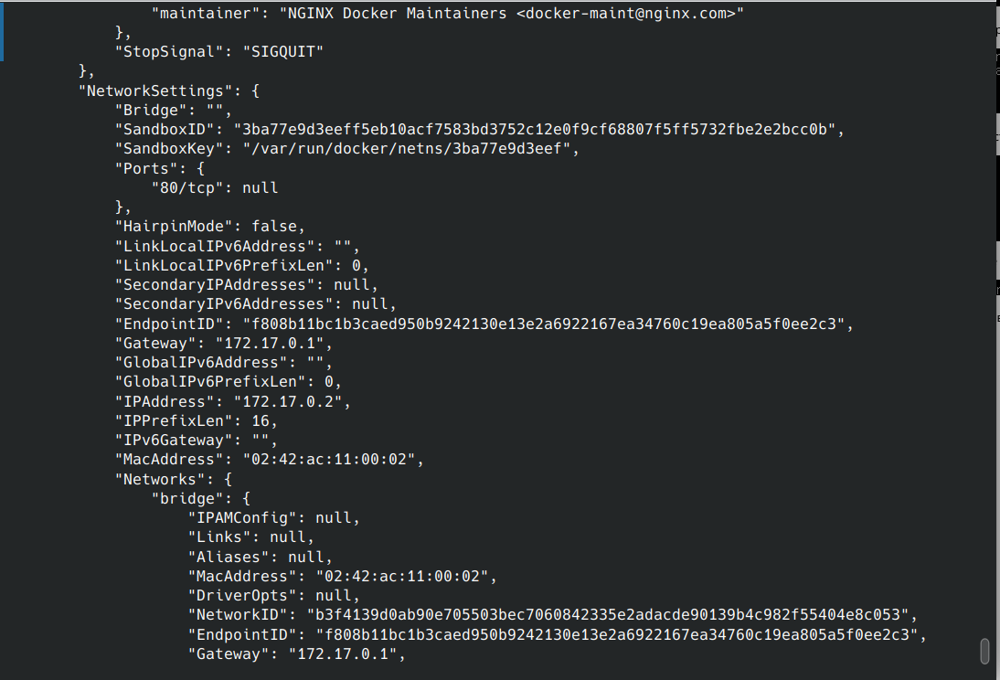
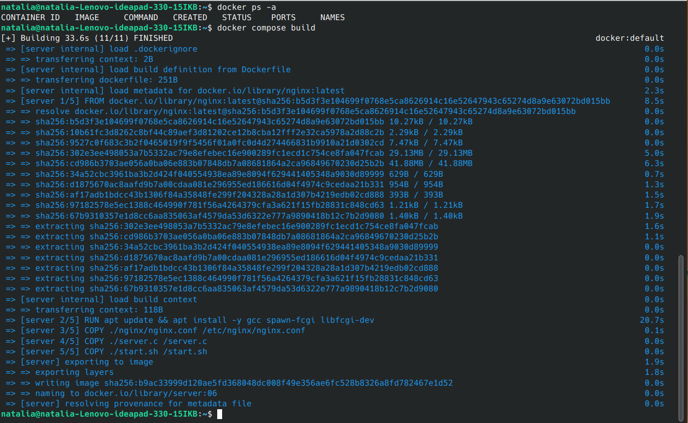

# Simple Docker
Введение в докер. Разработка простого докер-образа для собственного сервера.

## Part 1. Готовый докер

1.Скачиваем докер-образ nginx последней версии `docker pull nginx`

2.Проверяем наличие докер-образа на локальной машине `docker images`

3.Запускаем контейнер из образа командой `docker run -d nginx` флаг -d или --detach для запуска контейнера в фоновом режиме

4.Проверяем, что образ запустился командой `docker ps`(флаг -а можно использовать, чтобы видеть и остановленные контейнеры).

5.Информацию о контейнере можно узнать с помощью `docker inspect id контейнера`

6.Список замапленных портов и ip контейнера по умолчанию

7.Для просмотра размера контейнера нужно добавить флаг -s или --size, так же можно отфильтровать json

8.Останавливаем контейнер  `docker stop id контейнера` и проверяем, что он остановился `docker ps -a`

9.Запускаем контейнер с мапингом портов 80 и 443 на такие же порты на локальной машине, через команду run

`docker run -p 80:80 -p 443:443 -d nginx`

10.Для проверки, что в браузере по адресу localhost:80 доступна стартовая страница nginx. Используем `curl localhost:80`

11.Перезапускаем контейнер `docker restart ` и проверяем, что контейнер запустился `docker ps`

## Part 2. Операции с контейнером

1.Прочитаем конфигурационный файл nginx.conf внутри докер контейнера через команду exec.

Для "входа" в контейнер выполняем `docker exec -it id контейнера cat /etc/nginx/nginx.conf`

2.Создаем на локальной машине файл nginx.conf.

Для настройки отдачи страницы статуса сервера nginx по пути /status, нужно дописать инструкцию в файл конфига.
За отдачу статуса отвечает модуль ngx_http_status_module, который должен быть по умолчанию включен в nginx

3.Копируем созданный файл nginx.conf внутрь через команду `docker cp nginx.conf <id conteiner>:/etc/nginx/nginx.conf`

4.Перезапускаем nginx внутри докер-образа. Для этого опять заходим внутрь контейнера и выполняем команды:

`nginx -t` для проверки правильности конфига

`service nginx reload` для перезапуска nginx с новым конфигом

5.Проверяем, что по адресу localhost:80/status отдается страничка со статусом сервера nginx.

6.Экспортируем контейнер в файл container.tar через команду export

`docker export -o container.tar <id container>`

7.Останавливаем контейнер `docker stop <id container>`

8.Удаляем образ  `docker rmi <id image> -f` , не удаляя перед этим контейнеры. (так как нельзя удалить образ на основе которого в системе имеются контейнеры, используем флаг -f)

9.Удаляем остановленный контейнер `docker rm <id container>`

10.Импортируем контейнер обратно через команду import. docker import -c CMD ["nginx". "-g". "daemon off;"]container.tar nginx При этом следует использовать флаг -c с инструкцией CMD для корректного восстановления образа

11.Далее запускаем импортированный контейнер и проверяем, что по адресу localhost:80/status отдается страничка со статусом сервера nginx

## Part 3. Мини веб-сервер

1.Напишем мини-сервер на C и FastCgi, который будет возвращать простейшую страничку с надписью Hello World!.

Создаем простейший сервер по официальной документации.

2.Меняем конфиг nginx

3.Удаляем старый контейнер и запускаем новый с маппингом 81 порта

4.Обновляем пакеты в контейнере и установить недостающее для компиляции сервера. 

Выполняем `docker exec <id container>  apt update` и затем  `docker exec <id conteiner> apt install -y gcc spawn-fcgi libfcgi-dev`(к контейнеру можно обращаться не только по ID, но и по имени). 

5.На основе получившегося контейнера делаем образ с установленными пакетами, чтобы в случае чего можно было легко запустить новый контейнер `docker commit <id container> <name image>`

6.Копируем ранее подготовленный nginx.conf и sourse сервера в контейнер

7.Компилируем исходник командой `docker exec <id conteiner> gcc ./server.c -l fcgi -o fcgi_server`и запускаем скомпилированный сервер на порту 8080 `docker exec <id conteiner> spawn-fcgi -p 8080 fcgi_server`

8.Перезапускаем nginx с новым конфигом, выполнив `docker exec <id container> nginx -s reload` и проверяем работоспособность `curl 127.0.0.1:81`

## Часть 4. Свой докер

Напишем свой докер-образ

1.Создаем файл Dockerfile на основе официального образа nginx

Директивы на 4, 5 и 6 строках копируют файлы в контейнер, на 3 строке обновляют пакеты и устанавливают необходимое для компиляции

На 9 строке запускают скрипт:

2.Собираем образ командой, задаем ему имя new_server и тег 05 `docker build . -t new_server:05` и проверяем:

3.Запускаем контейнер на основе нашего образа с маппингом 81 порта на 80 и пробрасываем на локалхост конфиг nginx, после этого проверяем что все запустилось и сервер корректно отвечает:

`docker run -d -p 80:81 -v ./nginx/nginx.conf:/etc/nginx/nginx.conf new_server:05`

`curl 127.0.0.1:80`

4.Изменяем nginx.conf дописав туда проксирование статуса сервера по пути /status:

5.Для применения изменений перезапускаем контейнер и проверяем появилась ли страница статуса:

`docker restart <id conteiner>` и `curl 127.0.0.1:80/status`

## Часть 5. Доккл

1.Устанавливаем dockle согласно официальной документации.
 
2.Запускаем командой:

`sudo dockle new_server:05` и получаем некоторое количество ошибок.

3.Приступаем к исправлению. 

3.1.Включаем Content Trust для Docker:

`export DOCKER_CONTENT_TRUST=1`

3.2.Исправляем Dockerfile. Добавляем пользователя, запускаем сервер от его имени и добавляем HEALTHCHECK для проверки работоспособности контейнеров.

3.3.Подтверждаем 'setgid и setuid'.

3.4.Так же dockle показывает, что в образе есть потенциально опасные ключи: CIS-DI-0010: Do not store credential in environment variables/files, но это ключи базового образа nginx.

Вывод этого сообщения можно подавить убрав ключи Nginx из сканирования:

`dockle --accept-key NGINX_GPGKEYS --accept-key NGINX_GPGKEY_PATH new_server:05`

3.5.Запускаем создание образа с новыми настройками и проверяем dockle.

## Часть 6. Базовый Docker Compose

1.Смотрим nginx.conf:

2.Для Nginx нужен свой конфиг nginx2.conf. Создаем и сохраняем в папку nginx:

3.Пишем docker-compose.yml:

4.Проверяем скрипт запуска сервера, порт должен быть согласно docker-compose - 8080

5.Проверяем, что нет запущенных контейнеров и создаем образ нашего сервера из docker-compose:

`docker compose build`

6.Запускаем: `docker compose up -d`, проверяем что контейнеры запустились, работают и тестируем работу сервисов, видим приветствие Hello World!:

